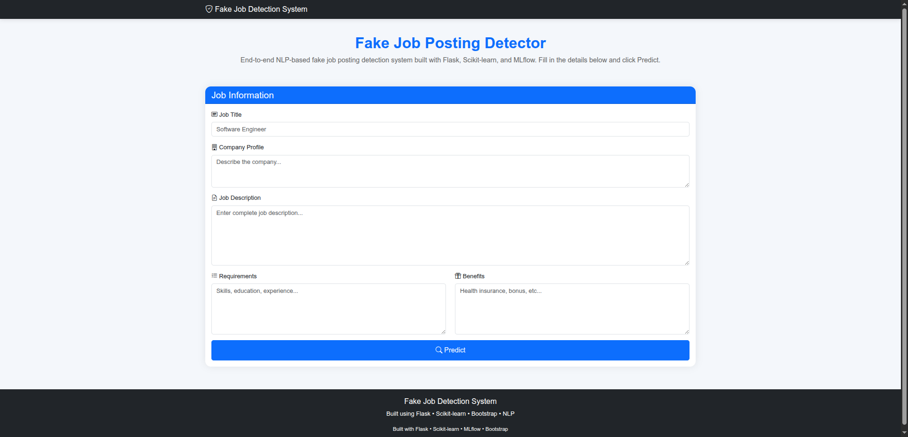

# 🚀 Fake Job Posting Detection System

An end-to-end NLP-based machine learning system for detecting fraudulent job postings using **TF-IDF** and **Linear SVM**. The project demonstrates a production-oriented ML workflow, including data ingestion, validation, transformation, model training, experiment tracking with MLflow, model inference through Flask, Docker containerization, CI/CD with GitHub Actions, and cloud deployment on Render.


## 🌐 Live Demo

The application is deployed on **Render** and can be accessed here:
🔗 [Live Demo](https://fake-job-posting-detection-ml-system.onrender.com)


## 📸 Application Preview

### Home Page




## 📑 Table of Contents

- [Project Overview](#-project-overview)
- [Features](#-features)
- [System Architecture](#-system-architecture)
- [Tech Stack](#️-tech-stack)
- [Repository Structure](#-repository-structure)
- [Machine Learning Pipeline](#-machine-learning-pipeline)
- [Model Performance](#-model-performance)
- [Installation](#-installation)
- [Run with Docker](#-run-with-docker)
- [Live Demo](#️-live-demo)
- [Future Improvements](#-future-improvements)
- [Author](#-author)


## 📌 Project Overview

Fake job postings have become an increasingly common form of online fraud, making it difficult for job seekers to distinguish legitimate opportunities from deceptive ones. This project aims to automatically identify fraudulent job advertisements using Natural Language Processing (NLP) and Machine Learning techniques.

The primary objective of this project was not only to build an accurate classification model but also to design a **production-oriented end-to-end machine learning system**. The project follows a modular architecture covering data ingestion, validation, transformation, model training, experiment tracking with MLflow, prediction pipeline, containerization with Docker, CI/CD using GitHub Actions, and cloud deployment on Render.

The final model uses **TF-IDF** for text feature extraction and a **Linear SVM** classifier, achieving high performance while maintaining fast inference suitable for real-world deployment.


## 📂 Dataset

This project uses the **Fake Job Posting Prediction** dataset for binary classification.

| Property | Value |
|----------|-------|
| Task | Binary Classification |
| Total Samples | 17,880 |
| Genuine Jobs | 17,014 |
| Fraudulent Jobs | 866 |
| Class Imbalance | ~95% Genuine, ~5% Fraudulent |

The dataset contains structured attributes and multiple textual fields, including job title, company profile, description, requirements, and benefits. This project focuses primarily on the textual information for fraud detection.


## ✨ Features

- 📄 End-to-end NLP-based fake job posting detection system
- ⚙️ Modular and configurable ML pipeline architecture
- 📥 Automated data ingestion, validation, and transformation
- 📝 Text preprocessing with custom NLP pipeline
- 🔤 TF-IDF feature extraction with configurable parameters
- 🤖 Linear SVM classifier for fraud detection
- 📊 MLflow experiment tracking and model management
- 💾 Serialized model and preprocessor for inference
- 🌐 Flask-based web application for real-time predictions
- 🐳 Docker containerization for reproducible deployment
- 🔄 CI pipeline using GitHub Actions
- ☁️ Cloud deployment on Render

The application is containerized with Docker to ensure consistent execution across different environments. A GitHub Actions workflow automatically validates the project on every push, helping maintain code quality before deployment.


## 🏗️ System Architecture

```text
                           Training Pipeline
┌────────────────────────────────────────────────────────────────────────────┐

            Fake Job Dataset
                   │
                   ▼
        +----------------------+
        |   Data Ingestion      |
        +----------------------+
                   │
                   ▼
        +----------------------+
        |  Data Validation      |
        +----------------------+
                   │
                   ▼
        +----------------------+
        | Data Transformation   |
        | • Text Preprocessing  |
        | • TF-IDF Vectorizer   |
        +----------------------+
                   │
                   ▼
        +----------------------+
        |   Model Training      |
        |     Linear SVM        |
        +----------------------+
                   │
                   ▼
        +----------------------+
        |       MLflow          |
        | Metrics & Parameters  |
        +----------------------+
                   │
                   ▼
        +----------------------+
        | Saved Artifacts       |
        | model.pkl             |
        | preprocessor.pkl      |
        +----------------------+

└────────────────────────────────────────────────────────────────────────────┘


                           Inference Pipeline

        User
          │
          ▼
+----------------------+
|    Flask Web App     |
+----------------------+
          │
          ▼
+----------------------+
| Prediction Pipeline  |
+----------------------+
          │
          ▼
+----------------------+
| Text Preprocessing   |
| TF-IDF Vectorizer    |
+----------------------+
          │
          ▼
+----------------------+
|   Linear SVM Model   |
+----------------------+
          │
          ▼
+----------------------+
| Prediction Result    |
| Genuine / Fake Job   |
+----------------------+
          │
          ▼
+----------------------+
| Docker + Render      |
+----------------------+
```


## ⚙️ Tech Stack

| Category | Technologies |
|----------|--------------|
| **Programming Language** | Python |
| **Machine Learning** | Scikit-learn, TF-IDF, Linear SVM |
| **Natural Language Processing** | NLTK |
| **Data Processing** | Pandas, NumPy |
| **Experiment Tracking** | MLflow |
| **Web Framework** | Flask |
| **Containerization** | Docker |
| **CI/CD** | GitHub Actions |
| **Cloud Deployment** | Render |


## 📂 Project Structure

```text
fake-job-posting-detection/
│
├── .github/workflows/        # CI pipeline
├── configs/                  # YAML configuration files
├── data/                     # Dataset
├── notebooks/                # EDA & model experimentation
├── src/
│   └── fake_job_detector/
│       ├── components/       # ML pipeline components
│       ├── config/           # Configuration manager
│       ├── entity/           # Configuration & artifact entities
│       ├── pipeline/         # Training & prediction pipelines
│       ├── utils/            # Helper utilities
│       ├── constants.py
│       ├── exception.py
│       ├── logger.py
│       └── mlflow_config.py
│
├── templates/                # Flask templates
├── artifacts/                # Saved model & preprocessor
├── app.py                    # Flask application
├── main.py                   # Training pipeline
├── Dockerfile
├── requirements.txt
├── setup.py
└── README.md
```


## 🔄 Machine Learning Pipeline

The project follows a modular end-to-end machine learning pipeline, where each stage is designed as an independent component to improve maintainability, scalability, and reusability.

| Stage | Description |
|-------|-------------|
| **Data Ingestion** | Loads the dataset and stores it in the artifacts directory. |
| **Data Validation** | Validates the dataset schema and checks data integrity before training. |
| **Data Transformation** | Combines text features, performs NLP preprocessing, and converts text into TF-IDF vectors. |
| **Model Training** | Trains a Linear SVM classifier and evaluates it using multiple performance metrics. |
| **Experiment Tracking** | Logs parameters, metrics, and trained models using MLflow. |
| **Prediction Pipeline** | Loads the saved model and preprocessor to perform real-time inference. |
| **Deployment** | Serves predictions through a Flask application containerized with Docker and deployed on Render. |


## 📊 Model Performance

| Metric | Score |
|--------|------:|
| Accuracy | **98.71%** |
| Precision | **88.96%** |
| Recall | **83.82%** |
| F1 Score | **86.31%** |
| ROC-AUC | **98.23%** |

> **Model:** Linear SVM  
> **Feature Extraction:** TF-IDF Vectorizer
The final model was selected after comparing multiple classical machine learning algorithms and tuning hyperparameters.


## 🚀 Installation

### Clone the repository

```bash
git clone https://github.com/rushee-67/fake-job-posting-detection.git
cd fake-job-posting-detection
```

### Create a virtual environment

```bash
python -m venv myenv
source myenv/bin/activate        # Linux/macOS
myenv\Scripts\activate           # Windows
```

### Install dependencies

```bash
pip install -r requirements.txt
pip install -e .
```

### Train the model

```bash
python main.py
```

### Run the application

```bash
python app.py
```


## 🐳 Run with Docker

Build the Docker image:

```bash
docker build -t fake-job-posting-detection .
```

Run the container:

```bash
docker run -p 5000:5000 fake-job-posting-detection
```

Access the application at:

```text
http://localhost:5000
```


## 🚀 Future Improvements

- Replace TF-IDF with contextual text embeddings (e.g., Sentence Transformers) to improve semantic understanding.
- Introduce model monitoring and automated retraining pipelines.
- Integrate a model registry for model versioning and lifecycle management.
- Add REST API endpoints for easier integration with external applications.
- Expand the dataset to improve model robustness and generalization.


## 👨‍💻 Author

**Rusheenddra Basani**

If you found this project interesting, feel free to ⭐ the repository.